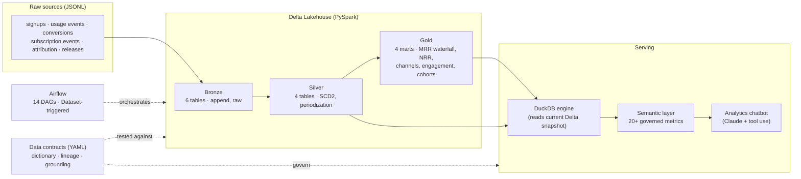

# Growth Analytics Platform

[](https://github.com/uncoated-engineering/growth-analytics-pipeline/actions/workflows/ci.yml)

An end-to-end **data platform for a (synthetic) SaaS product-led-growth company** —
from raw event feeds to governed metrics to a natural-language analytics chatbot.

Built as a portfolio project to demonstrate the full data stack: lakehouse
engineering (Spark + Delta), orchestration (Airflow Datasets), data
governance (contracts, dictionary, lineage, contract tests), a semantic layer
(DuckDB serving), and an LLM analytics agent (Claude tool use) — all wired
together so that a single YAML contract per table drives the docs, the
lineage graph, the chatbot's grounding, and the CI checks that keep them honest.



## Highlights

| Layer | What's here | Where |
|---|---|---|
| **Ingestion & modeling** | Medallion architecture on Delta Lake; SCD Type 2 with `MERGE`; subscription event periodization; MRR waterfall consistent by construction | `spark/jobs/` |
| **Orchestration** | 14 per-table Airflow DAGs wired by **Datasets** (data-aware scheduling), each with input/output data-quality gates | `airflow/dags/` |
| **Governance** | One YAML **contract** per table → generated data dictionary + OpenLineage-style lineage; **contract tests** assert contracts == Spark schemas == Airflow wiring | `contracts/`, `docs/`, `tests/semantic/` |
| **Semantic layer** | Governed metrics as SQL aggregate expressions (ratios of sums — no "average of averages"), compiled and validated, served by DuckDB over the exact Delta snapshot | `semantic/` |
| **AI analytics** | Chatbot that answers business questions via two tools — governed metric queries and guarded read-only SQL — showing every query it runs | `chatbot/` |
| **Engineering practice** | CI (lint/format/types/tests), tests mirroring the source tree, pre-commit hooks, ADRs for every major decision | `.github/`, `tests/`, `docs/adr/` |

## The data story

`scripts/generate_synthetic_data.py` generates one year (2024) of PLG SaaS
data for 5,000 users with **engineered causal signals**, so every downstream
analysis has ground truth to find (ADR 0004):

- **Feature adoption drives conversion** — per-feature conversion boosts;
  `real_time_collab` users convert at ~40% vs ~21% without.
- **Channel quality drives funnel performance** — referral converts at ~41%,
  outbound at ~22%; ~5% of signups are deliberately unattributed.
- **Feature adoption drives retention** — each adopted feature lowers the
  monthly churn hazard in the subscription lifecycle simulation.
- **MRR compounds realistically** — new business, seat expansion/contraction,
  plan changes, and churn produce a waterfall growing $0 → ~$2.3M ending MRR
  with NRR hovering around 100%.

## Quickstart

Prereqs: Python 3.12+, [uv](https://docs.astral.sh/uv/), Java 11+ (for Spark).

```bash
make setup            # create venv, install dependencies
make generate-data    # synthesize the raw sources (seeded, reproducible)
make pipeline         # bronze → silver → gold (full Delta lakehouse)

# Explore
uv run python -m semantic.cli tables
uv run python -m semantic.cli query conversion_rate -d acquisition_channel
uv run python -m semantic.cli query ending_mrr net_revenue_retention -d month
uv run python -m semantic.cli sql "SELECT current_plan, count(*) FROM silver_user_dim GROUP BY 1"

# Chat with the data (needs ANTHROPIC_API_KEY)
make chatbot                     # Streamlit app
uv run python -m chatbot.cli "Which acquisition channel brings the best customers?"
```

Example — the semantic layer answering from the governed catalog:

```text
$ uv run python -m semantic.cli query conversion_rate signups -d acquisition_channel -o "conversion_rate desc"
acquisition_channel  conversion_rate      signups
-------------------------------------------------
referral             0.412573673870334    509
content_marketing    0.35929203539823007  565
organic_search       0.33976510067114096  1192
unattributed         0.336283185840708    226
partner              0.2900763358778626   393
paid_search          0.2760041194644696   971
paid_social          0.2189265536723164   708
outbound             0.21788990825688073  436
```

## The lakehouse

Fourteen Delta tables across three layers — full column-level documentation in
the generated **[data dictionary](docs/data_dictionary.md)** and the
**[lineage graph](docs/lineage.md)** (both regenerated from `contracts/` via
`make docs`).

| Layer | Tables |
|---|---|
| Bronze (raw, append) | `feature_releases`, `user_signups`, `feature_usage_events`, `conversions`, `marketing_attribution`, `subscription_events` |
| Silver (conformed) | `silver_feature_states` (SCD2), `silver_user_dim`, `silver_feature_usage_facts`, `silver_subscription_periods` |
| Gold (marts) | `gold_feature_conversion_impact`, `gold_mrr_waterfall`, `gold_channel_performance`, `gold_weekly_engagement` |

Modeling choices worth reading: subscription lifecycle as an **event log
periodized in silver** (ADR 0005) and an MRR waterfall whose identity
`ending = starting + net_new` holds **by construction** every month.

## Orchestration

Airflow runs one DAG per table with a uniform quality-gated chain:

```
assert_input_quality  >>  process  >>  assert_output_quality
```

Bronze DAGs run `@daily` and publish **Airflow Datasets**
(`delta://bronze/<table>`); silver and gold DAGs are triggered *by data*, not
by the clock — their schedule is the list of upstream Datasets (ADR 0003).
A governance test asserts the DAG wiring matches the lineage declared in the
contracts, so orchestration and documentation cannot drift apart.

```bash
make airflow-standalone    # local Airflow with all 14 DAGs
```

## Governance: contracts as the single source of truth

Every table has a YAML contract (`contracts/<layer>/<table>.yml`) declaring
its description, grain, owner, typed columns, and upstreams. Everything else
derives from it:

- `docs/data_dictionary.md`, `docs/lineage.md`, `docs/lineage.json` — generated, never hand-edited
- the chatbot's schema grounding — rendered from the same objects
- **contract tests** — CI fails if a contract disagrees with the Spark job's
  `StructType`, or if declared upstreams disagree with the Airflow Dataset wiring

## Semantic layer

Metrics are defined once in `semantic/metrics.yml` as SQL aggregate
expressions over a single table, with an allow-list of dimensions. Ratio
metrics are ratios of sums, so **any** regrouping stays correct. A compiler
validates requests and emits DuckDB SQL; the engine resolves each Delta
table's *current* snapshot through delta-rs (never stale parquet). See
ADR 0006 for why this beats bolting on dbt or a metrics service here.

## The analytics chatbot

`chatbot/` is a small Claude agent with exactly two tools: `query_metric`
(governed, validated) and `run_sql` (single-statement, read-only, guarded).
Its grounding is generated from the contracts and metric catalog, and every
query it executes is displayed next to the answer — auditable AI analytics
rather than a black box (ADR 0007). Works as a Streamlit chat app and a
terminal CLI; without an API key the app degrades to a data-catalog browser.

## Development

```bash
make test-all             # full suite (Spark + Airflow + semantic + chatbot)
make lint                 # ruff
make format               # black + ruff --fix
make assert-typing        # mypy
make pre-commit-install   # git hooks (black, ruff, mypy, hygiene)
make docs                 # regenerate dictionary + lineage from contracts
make help                 # everything else
```

- **Tests mirror the source tree** — `tests/spark/jobs/silver/test_user_dim.py`
  tests `spark/jobs/silver/user_dim/`; governance tests live in
  `tests/semantic/`.
- **CI** (GitHub Actions) runs lint, format check, mypy, and the full test
  suite with Java + uv caching on every push/PR.

## Repository layout

```
├── contracts/          # YAML data contracts — the governance source of truth
├── spark/jobs/         # PySpark jobs: bronze/ silver/ gold/ + data_quality/
├── airflow/dags/       # 14 per-table DAGs + shared config (Datasets)
├── semantic/           # catalog, DuckDB engine, metric store + compiler, CLI
├── chatbot/            # Claude analytics agent, Streamlit app, CLI
├── scripts/            # data generator, docs generators
├── tests/              # mirrors the source tree; incl. contract tests
├── docs/               # ADRs + generated dictionary & lineage
├── notebooks/          # analysis demo
└── data/               # raw seeds (committed) + Delta lakehouse (generated)
```

## Architecture decision records

| ADR | Decision |
|---|---|
| [0001](docs/adr/0001-medallion-architecture-on-delta-lake.md) | Medallion architecture on Delta Lake + Spark |
| [0002](docs/adr/0002-per-table-jobs-with-validation-gates.md) | Per-table job modules with validation gates |
| [0003](docs/adr/0003-airflow-datasets-for-cross-dag-scheduling.md) | One DAG per table, wired with Airflow Datasets |
| [0004](docs/adr/0004-synthetic-data-with-engineered-signals.md) | Synthetic data with engineered causal signals |
| [0005](docs/adr/0005-subscription-lifecycle-events-and-periodization.md) | Subscription lifecycle as events, periodized in silver |
| [0006](docs/adr/0006-contracts-semantic-layer-duckdb.md) | Data contracts, YAML semantic layer, DuckDB serving |
| [0007](docs/adr/0007-analytics-chatbot.md) | Analytics chatbot: Claude tool use over the semantic layer |

## License

MIT
