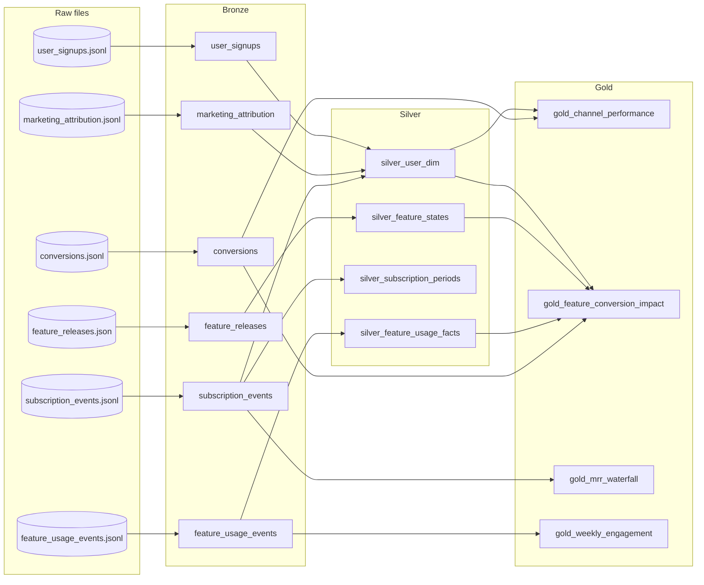

# Data Lineage

> Generated from the YAML data contracts in `contracts/` by
> `scripts/generate_lineage.py`. Do not edit by hand.

```mermaid
flowchart LR
  subgraph bronze["Bronze"]
    conversions[conversions]
    feature_releases[feature_releases]
    feature_usage_events[feature_usage_events]
    marketing_attribution[marketing_attribution]
    subscription_events[subscription_events]
    user_signups[user_signups]
  end
  subgraph silver["Silver"]
    silver_feature_states[silver_feature_states]
    silver_feature_usage_facts[silver_feature_usage_facts]
    silver_subscription_periods[silver_subscription_periods]
    silver_user_dim[silver_user_dim]
  end
  subgraph gold["Gold"]
    gold_channel_performance[gold_channel_performance]
    gold_feature_conversion_impact[gold_feature_conversion_impact]
    gold_mrr_waterfall[gold_mrr_waterfall]
    gold_weekly_engagement[gold_weekly_engagement]
  end
  subgraph raw["Raw files"]
    src_conversions[(conversions.jsonl)]
    src_feature_releases[(feature_releases.json)]
    src_feature_usage_events[(feature_usage_events.jsonl)]
    src_marketing_attribution[(marketing_attribution.jsonl)]
    src_subscription_events[(subscription_events.jsonl)]
    src_user_signups[(user_signups.jsonl)]
  end
  src_conversions --> conversions
  src_feature_releases --> feature_releases
  src_feature_usage_events --> feature_usage_events
  src_marketing_attribution --> marketing_attribution
  src_subscription_events --> subscription_events
  src_user_signups --> user_signups
  feature_releases --> silver_feature_states
  feature_usage_events --> silver_feature_usage_facts
  subscription_events --> silver_subscription_periods
  user_signups --> silver_user_dim
  marketing_attribution --> silver_user_dim
  subscription_events --> silver_user_dim
  silver_user_dim --> gold_channel_performance
  conversions --> gold_channel_performance
  silver_user_dim --> gold_feature_conversion_impact
  silver_feature_states --> gold_feature_conversion_impact
  silver_feature_usage_facts --> gold_feature_conversion_impact
  conversions --> gold_feature_conversion_impact
  subscription_events --> gold_mrr_waterfall
  feature_usage_events --> gold_weekly_engagement
```
